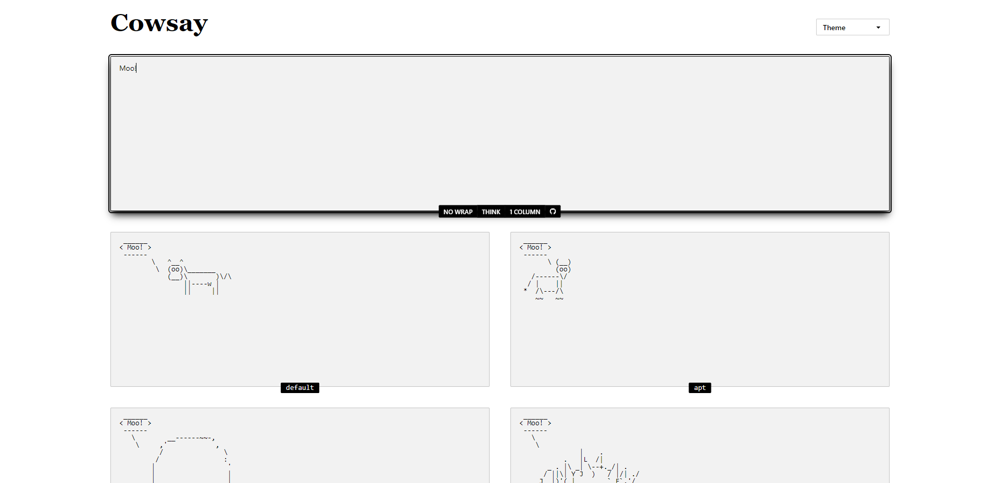

# Cowsay 🐄

## Screenshots



## To do

- [ ] Find formula based on condition [`state2`](/src/components/Cowsay.jsx/#L236) >= [`lg:grid-cols-2`](/src/components/Cowsay.jsx/#L272)

## Tree files

```text
📂README
 ┗ 📂images
 ┃ ┗ 📂screenshots
 ┃ ┃ ┗ 1.png

📂src
 ┣ 📂components
 ┃ ┗ Cowsay.jsx
 ┣ 📂css
 ┃ ┣ index.scss
 ┃ ┗ _tailwindcss.scss
 ┣ 📂data
 ┃ ┗ quotes.json
 ┣ App.jsx
 ┣ App.scss
 ┗ main.jsx
```

## Development

```text
 _______________
/ $ npm i       \
\ $ npm run dev /
 ---------------
        \   ^__^
         \  (oo)\_______
            (__)\       )\/\
                ||----w |
                ||     ||
```
